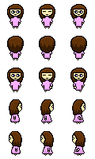

# GidaMan
GidaMan, a modified version of the game Pac-Man which had become an icon of the 1980s, is a game where Lucy - the main character of the game, often have nightmares of four ghosts; namely, White Lady, Dewende, Manananggal and Serena, chasing her until the end with the objective of killing her. While running away from them, she had entered a part of her dream where she meets Diwata, a fairy who said that she can get away from the murderous ghosts by collecting dream catchers in Dreamland - a place where most probably nightmares and the four lurking ghosts exist.

The goal of the game is to collect dreamcatchers by eliminating all ghosts and also defeat their boss to win. One can also collect tokens, not just dreamcatchers, by destroying random crates in Dreamland.

  <h1>Characters</h1>
  <table>
    <tr>
      <th>Characters</th>
      <th>Name</th>
      <th>Max HP</th>
      <th>Attack Damage (Magic Fireball)/s</th>
    </tr>
    <tr>
      <td>
        
      </td>
      <td align="left">
        

          <ul>White Lady</ul>
          <ul>Boss White Lady (Red) - the death of the boss determines the end of the game</ul>
        

      </td>
      <td>
        

          <li>10</li>
          <ul>150</ul>
        

      </td>
      <td>
        <ul>
          <ul>2</ul>
          <ul>2</ul>
        </ul>
      </td>
    </tr>
    <tr>
      <td>
        
      </td>
      <td>Dewende</td>
      <td>10</td>
      <td>2</td>
    </tr>
    <tr>
      <td>
        
      </td>
      <td>Manananggal</td>
      <td>10</td>
      <td>2</td>
    </tr>
    <tr>
      <td>
        
      </td>
      <td>Lucy</td>
      <td>500</td>
      <td>2</td>
    </tr>
    <tr>
      <td>
        
      </td>
      <td>Serena</td>
      <td>10</td>
      <td>2</td>
    </tr>
  </table>

  <h1>Tokens/Destructibles</h1>
  <table>
    <tr>
      <th>Token</th>
      <th>Name</th>
      <th>Description</th>
    </tr>
    <tr>
      <td></td>
      <td>Dreamcatcher</td>
      <td>Obtained by killing lurking ghosts and earn 5 points each.</td>
    </tr>
    <tr>
      <td></td>
      <td>Heart</td>
      <td>Obtained by killing lurking ghosts and can refill health by 2 HP.</td>
    </tr>
    <tr>
      <td></td>
      <td>Random Crate</td>
      <td>Destroy random crates and obtain either a heart or a dreamcatcher.</td>
    </tr>
  </table>

